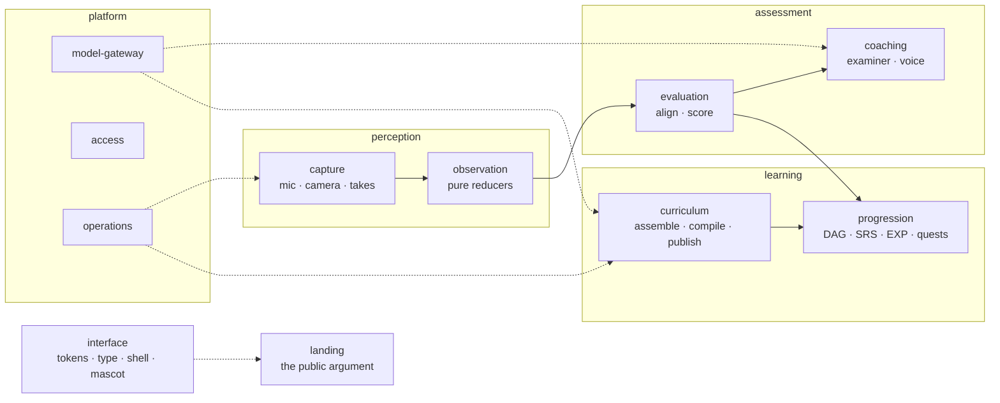

# High-Level Design: ScaleUp

## Problem

Learning an instrument alone has two failure modes that reinforce each other.

The first is **unmeasured practice**. A learner cannot hear their own intonation drift, cannot
tell rushing from unevenness, and cannot see their own posture. Without an outside signal,
practice repeats errors until they are habits.

The second is **silent decay**. Technique that is not practised fades, and nothing tells the
learner which of the hundred things they once could do has quietly stopped working. A tutor
supplies both signals — measurement in the moment, and memory across months — which is most
of what a tutor is for and most of what makes one expensive.

## Approach

### A prerequisite graph of skills, not a course

Skills form a directed acyclic graph. A skill unlocks when its prerequisites are sufficiently
mastered, so a learner is never handed something they cannot yet do, and never gated behind
something they already know. The graph is data rather than code, which is why a new instrument
is a curriculum rather than a release.

### One skill catalogue, many instruments

Instruments overlap far more than they differ. Reading a quarter note, keeping time,
orienting yourself on the instrument, shaping a phrase — these are the same skills whether the
learner is holding a guitar, a banjo, or a trumpet. So skills are defined once, in a shared
catalogue keyed by stable identity, and an instrument curriculum is a **selection and a
specialisation**: it names the catalogue skills it includes and overrides only what genuinely
differs for that instrument.

Specialisation is deliberately narrow. An instrument may restate a skill's title and summary
in its own vocabulary, adjust its difficulty, and name the exercise and evaluator that realise
it physically. It may not redefine what the skill *is*. A skill whose meaning has to change to
fit an instrument is a different skill, and belongs in the catalogue as one.

Prerequisite edges are the exception to sharing. The catalogue may suggest edges between
catalogue skills, but an instrument's graph is its own: what must come before what is a
pedagogical claim about *that* instrument, and forcing one ordering across all of them is how
a shared curriculum starts teaching the wrong thing next.

### A stated goal becomes a tree

A learner arrives with a sentence — "I want to learn how to play guitar" — not with a
curriculum. Turning that sentence into a playable prerequisite graph is the product's front
door, and it runs on the catalogue rather than on documents.

The instrument is resolved from the learner's own words. Where it names an instrument the
catalogue already covers, the tree is **assembled deterministically**: the reviewed selection
and specialisation for that instrument, the same definition the project ships, landed as a
published curriculum version. No model is involved and nothing is invented, because the
answer was already authored.

Where it names an instrument nothing covers, the catalogue still supplies the spine. Reading,
pulse, orientation and phrasing are the same skills on a cello as on a guitar, so the shared
selection is assembled first and a model proposes only the specialisation — which catalogue
skills apply, which concepts are particular to the instrument, and what must come before
what. Every proposal is validated against the catalogue's identities and the graph's acyclicity
before it is stored; a proposal that fails validation is refused rather than repaired. With no
provider configured the learner still gets the shared spine, because the deterministic path is
the floor.

**Every tree records how it was made,** and says so where the learner can see it. A tree
assembled from a reviewed curriculum, a tree proposed by a model, and a tree compiled from
source documents are all playable immediately and none of them pretends to be another.

### Measurement, then language

A take is aligned to notation and reduced to metrics — pitch, rhythm, dynamics, technique,
posture. Those metrics are then translated into an examiner's assessment. The split is
load-bearing: the numbers are deterministic and reproducible, and the language is a rendering
of them. A model may improve the wording; it may never alter a score.

Physical technique is judged against the skill the learner attempted, not against an instrument
in the abstract. Each assessable skill declares the visual metrics it requires, which ones are
critical, how they are weighted, and how much visible evidence is enough to make a judgement.
Frame observations reduce to one take-level outcome: **pass**, **retry**, or **insufficient
evidence**. A momentary tracking error cannot fail a take, and missing or occluded landmarks
cannot pass one. The aggregate retains its requirement breakdown and timestamped evidence so the
learner can see why the outcome was reached.

### Corrections while playing, not after

Short spoken corrections land at phrase ends during a take, in an examiner's voice. Post-take
feedback is the fallback, not the design. This is the capability that distinguishes the
product from a scoring tool.

### Decay as the scheduler

Mastery is a function of elapsed time since last review. Nothing time-derived is stored;
proficiency and node state are computed on read. Decayed skills resurface as a daily board, so
retention is a mechanic rather than an exhortation.

## Target Users

**A person with an instrument in their hands and no teacher in the room.** They are working
alone, on their own schedule, with a laptop and a webcam and the instrument they are trying
to learn. They are not a beginner being sold a hobby and not a professional maintaining a
career — they are someone practising, who wants to know whether what they just played was
any good and what to do about it.

This shapes three things. Feedback has to be immediate, because there is nobody to ask.
It has to be honest about its own reach, because a learner with no second opinion cannot
correct a confident wrong claim. And the system has to remember across months what the
learner has forgotten, because nobody else is tracking it.

## Goals

1. **A skill tree that is right for any instrument**, assembled from shared skills plus what
   is genuinely particular to that instrument — so adding an instrument is a curriculum, not a
   release.
2. **Exercises and repertoire that belong on the node they hang from**, and that a learner
   would recognise as worth practising.
3. **Evaluation and coaching that are actually useful** — the score matches what a teacher
   would say, and the correction is the one worth giving.

The ordering matters: an accurate tree with poor exercises is a filing system, and good
exercises on a wrong tree teach the wrong thing next.

## Non-Goals

- **Not a curated catalogue of instruments.** Any instrument a learner names is playable.
  Curation is not the gate on what exists — it is the difference between a tree the project
  authored and a tree the system proposed, and that difference is recorded and shown rather
  than enforced by refusal.
- **Not a performance judge.** The system reports what it measured and refuses to characterise
  what it did not: fingering, embouchure, breath support, and musical taste are out of scope
  from audio alone.
- **Not a media library.** Takes are practice clips, owner-deletable, capped in size.
- **Not a replacement for a teacher** on anything the sensors cannot see.

## Tenets

*Ordered so that when two conflict, the higher wins.*

- **The learner always gets a complete grade, and the system never invents one.** Every take
  yields one overall score with no blank dimensions shown — achieved by renormalising across
  what was actually measured, not by scoring the unmeasured as zero. A drummer is not marked
  down for pitch; a learner with no webcam is not marked down for posture. Completeness is
  owed to the learner; a fabricated number is not a grade, it is a claim the system cannot
  support. *(Defensible opposite: give every dimension a number regardless, so grades are
  comparable across takes.)*
- **A pass belongs to a declared skill and an evidence window.** Instrument-wide posture is
  feedback, not a pass criterion. A progression result names the attempted skill, evaluates its
  declared requirements across the take, and distinguishes failing evidence from insufficient
  evidence. *(Defensible opposite: use one posture score and threshold for every skill on an
  instrument.)*
- **A skill has one definition; an instrument specialises it, never restates it.** When a new
  skill resembles one already in the catalogue, extend the catalogue entry rather than
  authoring a parallel copy under a different name. *(Defensible opposite: let each instrument
  own its skills end to end, so no instrument's wording is constrained by another's.)*
- **A tree says how it was made.** Assembled from a reviewed curriculum, proposed by a model,
  or compiled from sources — the provenance travels with the tree and is visible to the
  learner. Curation is a label, not a gate: everything is playable, and nothing claims an
  authority it does not have. *(Defensible opposite: present every tree identically, so the
  product feels uniform and no learner is primed to distrust their own curriculum.)*
- **The deterministic path is the floor, never a mock.** Everything works with no credentials
  and no network; providers improve quality and never gate function. *(Defensible opposite:
  require providers and let the product be as good as its dependencies.)*
- **One authority per fact.** One grading path, one progression system, one source of truth,
  one definition of a threshold. *(Defensible opposite: let each surface compute what it needs
  where it needs it.)*
- **Time is a parameter, never a clock read.** Anything that depends on elapsed time takes it
  as an argument. *(Defensible opposite: read the clock where you need it and keep signatures
  small.)*
- **Silence is a valid output.** The coach that has nothing useful to say says nothing.
  *(Defensible opposite: always give the learner something, since engagement is the product.)*
- **The public page claims only what the product already does.** Every number on a
  public surface is traceable to something in this repository or to a cited outside source,
  and a capability is described in the present tense only once it ships. Where the honest
  version of a claim is weaker, the honest version is the one that goes up. *(Defensible
  opposite: describe the product you are building toward, since a landing page is a promise
  and the roadmap is public anyway.)*

## System Design

Nine segments along the signal path, and two across it. Solid edges carry data; dotted edges
are services. **Interface** is drawn apart because it owns no behaviour: every segment's
surfaces are rendered in the visual language it holds — colour, type, focus, contrast, the
shell and the mascot that inhabits it — and a component belongs to the segment whose behaviour
it renders, not to the one whose stylesheet it uses.

**Landing** is drawn apart for the opposite reason: it owns no behaviour *and* renders none.
It is the argument for the product, addressed to someone who is not a learner yet, and it is a
segment rather than a page because what it may claim is a design constraint with teeth — see
the tenet below. It draws in interface's language and links into access; it reads no
learner state.

**Layering is one-directional and enforced:** routers → services → {repositories, models, llm,
vector} → domain. The domain layer imports nothing from the rest of the application, which is
why the graph, scheduling and coaching-policy rules test in milliseconds with nothing running.

**Postgres is the only authoritative write.** The graph store is a derived read-model for
traversal and the vector store a derived index for retrieval; both are rebuildable, so
consistency is a staleness metric rather than a correctness bug.

**Raw visual media stays in the browser.** Both a live camera and a learner-selected video file
are local frame sources for the same visual analyser. The visual path emits derived metrics,
never video or image buffers. A prerecorded file is not uploaded merely because it was selected
for analysis. Audio capture remains a separate subsystem and is preserved only as a
content-addressed recording its owner can delete. Visual frame metrics are aggregated locally
against a versioned skill-assessment profile; only the derived result and its evidence summary
may cross the browser boundary.

## Key Design Decisions

| Decision | Chosen | Alternatives | Rationale |
|---|---|---|---|
| Where scoring happens | Server-side, from note events | Server-side from audio; fully client-side | The server never hears audio: the browser detects notes and sends events. Keeps media local and scoring reproducible from a small payload. |
| Visual input sources | One analyser over live-camera and selected-video frame sources | Separate live and batch implementations; server-side video analysis | One reducer and one set of thresholds prevents uploaded-video feedback from drifting from live feedback. Local file decoding also preserves the raw-video privacy boundary. |
| Visual skill verdict | Versioned per-skill requirements reduced over the full evidence window to pass, retry, or insufficient evidence | Worst frame decides; one instrument-wide posture threshold; always emit pass/fail | Temporal aggregation prevents a tracking outlier from deciding the take. Per-skill requirements keep unrelated technique from blocking progression, while a third outcome keeps occlusion from becoming either a false pass or false failure. |
| Live coaching authority | Cues only; the persisted score comes from the standard attempt path | Persist the live matcher's result | One grading path means live and batch cannot drift, by construction rather than by discipline. |
| Curriculum authoring | Three paths to one shape: assembled from the catalogue, proposed by a model, or compiled from source | A single path for all cases | The paths differ in latency and in what they can be trusted for, not in output. Assembly answers a named instrument instantly; compilation earns evidence for an unnamed subject; proposal covers what neither has. All three produce the same versioned graph. |
| Turning a goal into a tree | Resolve the instrument from the learner's words, then assemble | Ask the learner to pick from a list; require source approval first | A sentence is what a learner actually arrives with. A list caps the product at what it already knows, and source approval puts a multi-minute pipeline in front of the first thing anyone sees. |
| An instrument nothing covers | Shared spine assembled, specialisation proposed and validated | Refuse the instrument; generate the whole tree from the model | Refusal makes "any instrument" false. Generating the whole tree throws away the reviewed selection that is the catalogue's entire point, and re-derives rhythm and reading badly. |
| A model-proposed tree | Playable immediately, provenance recorded and shown | Hold as a draft until reviewed | A tree in review teaches nobody. The honesty the tenet demands is satisfied by saying what the tree is, not by withholding it. |
| Skill reuse | A shared catalogue; instruments select and specialise | Standalone curriculum per instrument; one musicianship curriculum with instrument profiles | Standalone means every instrument re-authors quarter-note reading and posture, and improving one improves none of the others. A single curriculum with profiles assumes a shared spine that holds for rhythm and reading and breaks for technique — piano fingering, drum limb independence and violin bowing do not fit one shape. Selection-and-specialisation reuses what is genuinely common and lets the rest stay per-instrument. |
| Prerequisite edges | Owned per instrument | Inherited from the catalogue | What must come before what is a claim about a specific instrument. A shared ordering would teach the wrong thing next for whichever instrument it did not fit. |
| Specialisation surface | A fixed, declared set of overridable fields | Arbitrary per-instrument overrides | Unbounded overrides turn a catalogue back into five standalone curricula wearing a shared name. |
| Time-derived values | Computed on read | Stored and refreshed by a job | Storage guarantees drift the moment a threshold changes, and needs a scheduled job to stay honest. |
| Provider addressing | By role, resolved in one registry | By model at the call site | Re-pointing a stage is one line; the deterministic floor is a registry entry rather than a branch. |
| Prompt changes | A new version file, hash recorded per call | Edit in place | "Did the rubric edit help?" is unanswerable retroactively without the stored hash. |
| Containerisation | Datastores only; app on the host | Containerise everything | The working tree sits on a synced path where bind mounts do not propagate change events. |
| Visual design | One token layer; ramps inverted in place to repaint the whole app | Rewrite component classes per palette change | A palette revision stays a single-file change. The measured alternative was 643 component edits, with a long tail that would be missed. |
| Frontend | Next.js, typed against a hand-maintained contract mirror | A low-code builder | Media capture, typed contracts and the WebSocket coach need real control. The mirror is a known debt — see `OPS-CONTRACT-003`. |

## Success Metrics

Each goal has a falsification signal — the condition under which that goal would be judged
not met. Where a current measurement exists it is named; where none exists, that absence is
itself the first thing to fix.

**Goal 1 — the tree is right.** Measured as precision and recall of generated prerequisite
edges against a hand-authored reference tree, per instrument.
*Current: recall 0.397, precision 0.600 on the reference corpus.* Edge direction is already
reliable (zero backwards edges); node granularity is the failure. **Falsified if** a learner
is gated behind a skill they do not need, or handed one they are not ready for, more than
rarely. **Blocked:** the scoring harness and the reference tree are both missing from the
repository, so this number cannot currently be reproduced — restoring them is prerequisite
to improving anything else here.

**Goal 2 — the exercises belong.** Measured as the share of generated exercises a
knowledgeable reviewer judges appropriate to their node's stated skill and difficulty.
*Current: no measurement exists.* **Falsified if** a node's exercise does not exercise that
node's skill, or a difficulty-5 exercise is not meaningfully harder than a difficulty-1 one.
The present difficulty ladder moves only scale degrees, bar count and tempo, which is thin.

**Goal 3 — the feedback is useful.** Two halves, measured separately.
*Scoring:* agreement between the system's metric bundle and a teacher's assessment of the
same take, on a fixed set of takes covering perfect, slow, fast, wrong-pitch, missed-note,
extra-note and silence. **Falsified if** the system and a teacher disagree about whether a
take was good. Visual skill outcomes are measured against teacher-labelled good, incorrect,
partially occluded, and ungradable videos for every shipped instrument. They are falsified if a
brief outlier changes the outcome, if insufficient evidence becomes a pass or retry, or if the
declared skill's system outcome disagrees with the teacher more than rarely.
*Coaching:* whether the correction offered was the one worth giving at that moment. Every
model call already records prompt identifier, version and hash expressly so this becomes
answerable across prompt revisions. *Current: nothing reads the ledger for quality.*

**Retention**, underneath all three: whether scheduled review actually keeps skills alive.
*Current: never validated.* The time-travel script exists to make it measurable without
waiting months.

## References

- `docs/api_contract.md` — the contract between the backend and the client
- `docs/srs_and_exp.md` — scheduling and experience rationale
- `docs/integrations.md` — external services and their fallbacks
- `docs/roadmap.md` — the live work board
- `docs/arrows/index.yaml` — segment status, dependencies and drift
- `docs/archive/` — the textbook product this began as, and why its pipeline still runs underneath
- `CLAUDE.md` — repository-wide engineering conventions
